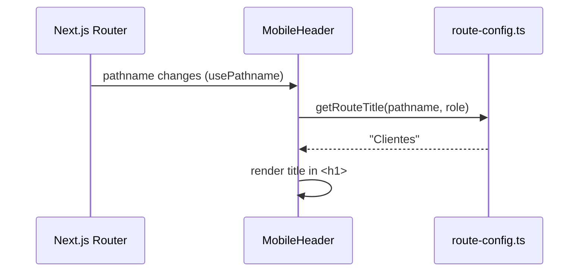
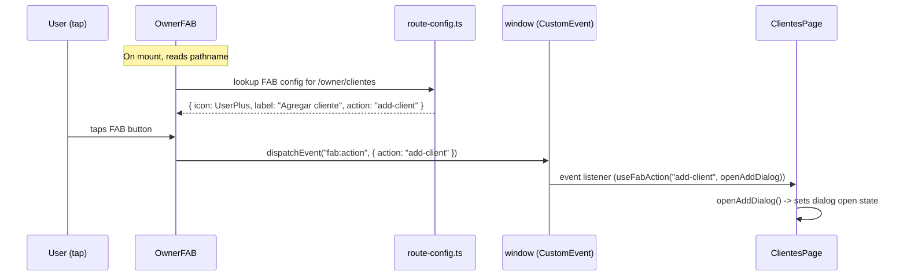
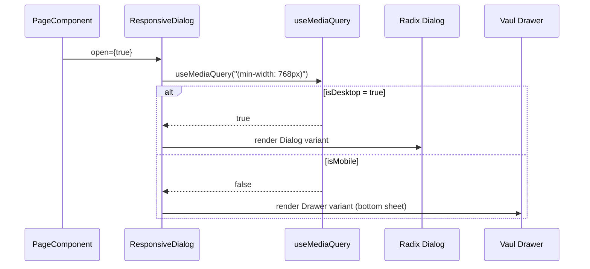
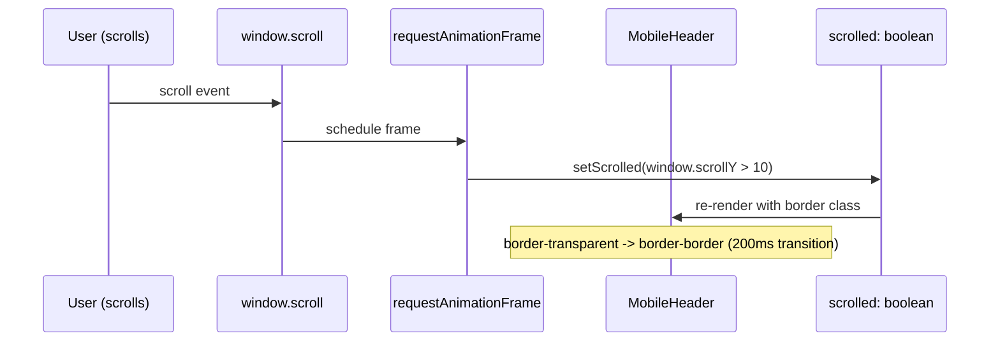

# Technical Design: Mobile-First UI Redesign

## 1. Architecture Decisions

### ADR-001: ResponsiveDialog Pattern -- Composition with Conditional Render

**Decision:** Use a composition component that wraps both `Dialog` (Radix) and `Drawer` (Vaul) and conditionally renders based on viewport width via the `useMediaQuery` hook.

**Options considered:**

| Option | Pros | Cons |
|--------|------|------|
| **A. Composition wrapper (chosen)** | Clean API matching Dialog; single import; SSR-safe | Two component trees rendered (only one mounted); slight bundle increase |
| B. HOC wrapping Dialog | Reuses Dialog props automatically | HOC pattern is outdated in React 19; harder to type |
| C. CSS-only (show/hide) | Zero JS; SSR-friendly | Both Dialog and Drawer mount simultaneously; focus-trap conflicts; double ARIA |

**Rationale:** Option A gives us a single `<ResponsiveDialog>` that internally checks `useMediaQuery("(min-width: 768px)")`. On mobile it renders Vaul's `Drawer`; on desktop it renders Radix's `Dialog`. Only one component tree mounts at a time, avoiding focus-trap conflicts. The API mirrors `Dialog` so migration is find-and-replace.

**Trade-offs:**
- On resize across the breakpoint (unlikely on real devices), the dialog closes and re-opens as the other type. Acceptable since this only affects desktop browser resizing, not real mobile usage.
- Adds `vaul` as a new dependency (~4KB gzipped).

---

### ADR-002: Mobile Detection -- `useMediaQuery` Hook + CSS Classes

**Decision:** Use a `useMediaQuery` hook for JS-conditional rendering (ResponsiveDialog, FAB visibility) and Tailwind responsive classes (`md:hidden`, `md:flex`) for layout-level show/hide.

**Options considered:**

| Option | Pros | Cons |
|--------|------|------|
| A. CSS-only everywhere | No hydration mismatch; SSR-safe | Cannot conditionally mount/unmount components (Dialog vs Drawer need different component trees) |
| **B. useMediaQuery + CSS (chosen)** | Best of both; JS only where needed | Hook returns `false` on SSR; requires hydration-safe default |
| C. JS-only (useMobile hook everywhere) | Consistent approach | Causes layout shift; re-renders on every resize; existing `md:hidden` pattern is simpler |

**Rationale:** The existing codebase already uses `md:hidden` / `md:flex` for sidebar/mobile-header toggling. We keep that for layout elements (bottom tab bar, sidebar, FAB container) since CSS is faster and SSR-safe. We only use `useMediaQuery` where we need to mount a fundamentally different component tree (Dialog vs Drawer). The existing `useMobile` hook at `src/hooks/use-mobile.ts` already does this -- we'll create a more generic `useMediaQuery` alongside it.

**Hydration strategy:** `useMediaQuery` returns `false` (desktop) on initial SSR render. For `ResponsiveDialog`, this means the Dialog variant renders on first paint, then swaps to Drawer after hydration on mobile. Since dialogs are user-triggered (not open on page load), there's no visible flash.

---

### ADR-003: FAB Contextual Actions -- Route Configuration Map

**Decision:** Define a static route-to-action configuration map in the FAB component. The FAB reads `usePathname()` and looks up the action.

**Options considered:**

| Option | Pros | Cons |
|--------|------|------|
| A. Context provider from each page | Pages control their own FAB action | Every page needs to wrap with provider; adds complexity; FAB re-renders on every page transition |
| **B. Route config map (chosen)** | Centralized; easy to maintain; no per-page code changes | FAB actions hardcoded; less flexible for dynamic actions |
| C. Prop drilling from layout | Simple | Layout doesn't know page content; breaks encapsulation |
| D. Route metadata (Next.js) | Clean separation | App Router doesn't support custom route metadata; would need file conventions |

**Rationale:** The owner has a fixed set of pages (10 routes) and only 5 need a FAB. A static map like `{ "/owner/clientes": { icon: UserPlus, label: "Agregar cliente", action: "add-client" } }` is the simplest solution. The FAB emits a custom event or calls a callback that the page listens to. This avoids context providers and keeps pages unmodified.

**Action dispatch:** The FAB dispatches a `CustomEvent` on `window` with `detail: { action: "add-client" }`. Pages that care listen for `fab:action` events. This decouples the FAB from page internals.

---

### ADR-004: Page Titles in Mobile Header -- Route Configuration Map

**Decision:** Use a static route-to-title map in the mobile header, matching the same pattern as the FAB.

**Options considered:**

| Option | Pros | Cons |
|--------|------|------|
| A. React Context from pages | Dynamic titles possible | Every page must set context; boilerplate |
| **B. Route config map (chosen)** | Zero per-page changes; consistent with FAB pattern | Only supports static titles |
| C. `document.title` scraping | Works with Next.js metadata | Requires DOM access; brittle; delayed |

**Rationale:** Page titles map 1:1 with routes (e.g., `/owner/clientes` -> "Clientes"). A shared config object exported from `src/lib/route-config.ts` serves both the FAB and the header, keeping a single source of truth.

---

### ADR-005: Scroll Detection for Sticky Header Border -- useEffect + RAF Throttle

**Decision:** Attach a `scroll` event listener on `window` inside a `useEffect`, throttled with `requestAnimationFrame`, updating a `scrolled` state boolean.

**Implementation:**
```typescript
const [scrolled, setScrolled] = useState(false);

useEffect(() => {
  let ticking = false;
  const onScroll = () => {
    if (!ticking) {
      requestAnimationFrame(() => {
        setScrolled(window.scrollY > 10);
        ticking = false;
      });
      ticking = true;
    }
  };
  window.addEventListener("scroll", onScroll, { passive: true });
  return () => window.removeEventListener("scroll", onScroll);
}, []);
```

**Trade-offs:** This is lightweight (~0 impact on frame rate due to RAF throttling and passive listener). An `IntersectionObserver` on a sentinel element is an alternative but adds DOM elements and is overkill for a single scroll threshold.

---

### ADR-006: Skeleton Loading -- Reusable Primitives Composed Per Route

**Decision:** Create a set of skeleton primitive components (`SkeletonCard`, `SkeletonList`, `SkeletonStatCard`, `SkeletonText`, `SkeletonAvatar`) and compose them in per-route `loading.tsx` files.

**Options considered:**

| Option | Pros | Cons |
|--------|------|------|
| A. One generic skeleton for all routes | Minimal files | Doesn't match real content layout; feels generic |
| **B. Reusable primitives + per-route composition (chosen)** | Content-aware; small primitive components; per-route files are ~10-15 lines each | More files (14 loading.tsx); maintenance overhead |
| C. Inline skeletons in each page component | Co-located; no extra files | No Suspense integration; manual loading state management |

**Rationale:** Next.js App Router's `loading.tsx` convention integrates with React Suspense automatically. Per-route skeletons provide the best perceived performance (content-aware placeholders). Shared primitives keep each `loading.tsx` file under 20 lines.

---

### ADR-007: Bottom Tab Bar Active Route Detection -- `usePathname`

**Decision:** Use Next.js `usePathname()` to determine the active tab by checking if the current path starts with the tab's href.

```typescript
const pathname = usePathname();
const isActive = pathname === tab.href || pathname.startsWith(tab.href + "/");
```

**Rationale:** This is the same pattern already used in `OwnerSidebar` and `ClientSidebar`. Consistent with existing codebase conventions. Using `startsWith` handles sub-routes (e.g., `/client/recompensas/123` still highlights the "Recompensas" tab).

---

## 2. Component Architecture

### 2.1 Client Layout Component Tree

```
ClientLayout (src/app/client/layout.tsx)
|-- AuthGuard logic (existing)
|-- <div className="flex min-h-screen flex-col md:flex-row">
|   |-- <ClientMobileHeader />           // mobile only (md:hidden)
|   |   |-- hamburger -> removed on client
|   |   |-- page title (from route config)
|   |   |-- <ThemeToggle />
|   |
|   |-- <ClientSidebar />                // desktop only (hidden md:flex)
|   |   |-- (unchanged from current)
|   |
|   |-- <div className="flex-1 flex flex-col">
|   |   |-- <header> (desktop)           // hidden md:flex
|   |   |-- <main className="flex-1 p-4 md:p-6 pb-20 md:pb-6 animate-in fade-in-0 duration-300">
|   |       |-- {children}               // route content
|   |
|   |-- <BottomTabBar />                 // mobile only (md:hidden)
|       |-- 5 tabs: Inicio, Recompensas, Reservas, Historial, Perfil
```

### 2.2 Owner Layout Component Tree

```
OwnerLayout (src/app/owner/layout.tsx)
|-- AuthGuard logic (existing)
|-- <div className="flex min-h-screen flex-col md:flex-row">
|   |-- <OwnerMobileHeader />            // mobile only (md:hidden)
|   |   |-- hamburger -> opens grouped Sheet
|   |   |-- contextual page title
|   |   |-- <ThemeToggle />
|   |
|   |-- <OwnerSidebar />                 // desktop only (hidden md:flex)
|   |   |-- (unchanged from current)
|   |
|   |-- <div className="flex-1 flex flex-col">
|   |   |-- <header> (desktop)           // hidden md:flex
|   |   |-- <main className="flex-1 p-4 md:p-6 animate-in fade-in-0 duration-300">
|   |       |-- {children}
|   |
|   |-- <OwnerFAB />                     // mobile only (md:hidden)
|       |-- contextual action per route
```

### 2.3 ResponsiveDialog Pattern

```
<ResponsiveDialog open={open} onOpenChange={setOpen}>
  <ResponsiveDialogContent>
    <ResponsiveDialogHeader>
      <ResponsiveDialogTitle>Title</ResponsiveDialogTitle>
      <ResponsiveDialogDescription>Desc</ResponsiveDialogDescription>
    </ResponsiveDialogHeader>
    {/* form content */}
    <ResponsiveDialogFooter>
      <Button>Cancel</Button>
      <Button>Save</Button>
    </ResponsiveDialogFooter>
  </ResponsiveDialogContent>
</ResponsiveDialog>

Internally:
- if (isDesktop) -> renders <Dialog> + <DialogContent> + ... (Radix)
- if (isMobile)  -> renders <Drawer> + <DrawerContent> + ... (Vaul)
```

### 2.4 EmptyState Component

```
<EmptyState
  icon={Users}
  title="Sin clientes"
  description="Aun no tienes clientes registrados."
  action={<Button onClick={...}>Agregar cliente</Button>}
/>

Renders:
<div className="flex flex-col items-center justify-center min-h-[300px] gap-4 p-8">
  <div className="rounded-full bg-muted p-4">
    <Icon className="size-12 text-muted-foreground/50" />
  </div>
  <h3 className="text-lg font-semibold">{title}</h3>
  <p className="text-sm text-muted-foreground max-w-sm text-center">{description}</p>
  {action && <div className="mt-4">{action}</div>}
</div>
```

---

## 3. New Components Catalog

### 3.1 BottomTabBar

- **File:** `src/components/layout/bottom-tab-bar.tsx`
- **Props:**

```typescript
interface TabItem {
  href: string;
  label: string;
  icon: LucideIcon;
  activeIcon?: LucideIcon; // filled variant when available
}

interface BottomTabBarProps {
  tabs: TabItem[];
}
```

- **Implementation:** Client component. Uses `usePathname()` for active detection. Renders a `<nav role="tablist">` with `<Link>` elements. Fixed bottom positioning with safe-area padding. Hidden at `md+`.

### 3.2 OwnerFAB (Floating Action Button)

- **File:** `src/components/layout/fab.tsx`
- **Props:**

```typescript
interface FABConfig {
  icon: LucideIcon;
  label: string; // used as aria-label
  action: string; // event identifier
}

// No external props -- FAB reads route internally
// Component is self-contained
```

- **Implementation:** Client component. Uses `usePathname()` to lookup action in a static map. Dispatches `CustomEvent("fab:action", { detail: { action } })` on click. Renders as a `<button>` with `fixed bottom-6 right-4 z-40 size-14 rounded-full`. Hidden at `md+` and on routes without FAB config.

### 3.3 ResponsiveDialog

- **File:** `src/components/ui/responsive-dialog.tsx`
- **Props:**

```typescript
interface ResponsiveDialogProps {
  open: boolean;
  onOpenChange: (open: boolean) => void;
  children: React.ReactNode;
}

// Sub-components mirror Dialog API:
// ResponsiveDialogContent, ResponsiveDialogHeader, ResponsiveDialogFooter,
// ResponsiveDialogTitle, ResponsiveDialogDescription, ResponsiveDialogClose
```

- **Implementation:** Client component. Uses `useMediaQuery("(min-width: 768px)")`. Conditionally renders Dialog (desktop) or Drawer (mobile). Drawer includes drag handle, `rounded-t-2xl`, `max-h-[90vh]`, swipe-to-dismiss.

### 3.4 EmptyState

- **File:** `src/components/ui/empty-state.tsx`
- **Props:**

```typescript
interface EmptyStateProps {
  icon: LucideIcon;
  title: string;
  description: string;
  action?: React.ReactNode;
  className?: string;
}
```

- **Implementation:** Server-compatible component (no hooks). Pure presentational. Centers content with flexbox. Min height 300px.

### 3.5 StatCard

- **File:** `src/components/ui/stat-card.tsx`
- **Props:**

```typescript
interface StatCardProps {
  title: string;
  value: string | number;
  description?: string;
  icon?: LucideIcon;
  trend?: "up" | "down" | "neutral";
  gradient?: string; // e.g., "from-primary/5 to-transparent"
  className?: string;
}
```

- **Implementation:** Composes `Card` with a gradient background layer. Displays icon in top-right, value prominently, trend indicator with color (success for up, destructive for down).

### 3.6 Skeleton Primitives

- **File:** `src/components/ui/skeleton.tsx` (install via shadcn if not present)
- **Additional file:** `src/components/ui/skeleton-patterns.tsx`
- **Exports:**

```typescript
// skeleton-patterns.tsx
export function SkeletonStatCard(): JSX.Element;   // Matches StatCard shape
export function SkeletonListItem(): JSX.Element;    // h-16 rounded-2xl
export function SkeletonCard(): JSX.Element;        // Full card with header + 3 lines
export function SkeletonAvatar(): JSX.Element;      // rounded-full size-16
export function SkeletonCalendar(): JSX.Element;    // Grid of small blocks
```

- **Implementation:** Compose the base `Skeleton` component into shapes matching real content. No props needed -- each is a fixed layout.

### 3.7 useMediaQuery Hook

- **File:** `src/hooks/use-media-query.ts`
- **API:**

```typescript
export function useMediaQuery(query: string): boolean;
```

- **Implementation:** Uses `window.matchMedia`. Returns `false` on SSR. Updates on media query change events. Debounce-free since `matchMedia` only fires on threshold crossings.

### 3.8 useFabAction Hook

- **File:** `src/hooks/use-fab-action.ts`
- **API:**

```typescript
export function useFabAction(action: string, callback: () => void): void;
```

- **Implementation:** Listens for `CustomEvent("fab:action")` where `detail.action` matches. Cleans up on unmount. Pages call this to respond to FAB taps.

### 3.9 Route Config

- **File:** `src/lib/route-config.ts`
- **API:**

```typescript
import type { LucideIcon } from "lucide-react";

interface RouteConfig {
  title: string;
  fab?: {
    icon: LucideIcon;
    label: string;
    action: string;
  };
}

export const ownerRouteConfig: Record<string, RouteConfig>;
export const clientRouteConfig: Record<string, RouteConfig>;

export function getRouteTitle(pathname: string, role: "owner" | "client"): string;
```

- **Implementation:** Static maps. Imported by MobileHeader and FAB. Single source of truth for page titles and FAB actions.

### 3.10 Drawer Component (Vaul)

- **File:** `src/components/ui/drawer.tsx`
- **Install:** `npx shadcn@latest add drawer` (adds `vaul` dependency)
- **API:** Standard shadcn Drawer exports (Drawer, DrawerContent, DrawerHeader, etc.)

---

## 4. Modified Components

### 4.1 `src/components/ui/card.tsx`

| Change | Before | After |
|--------|--------|-------|
| Border radius | `rounded-xl` | `rounded-2xl` |
| Border style | `border` | `ring-1 ring-border/50` |
| Shadow | `shadow-sm` | `shadow-[0_1px_3px_rgba(0,0,0,0.04),0_6px_24px_rgba(0,0,0,0.06)]` |
| Card padding | `py-6` | `p-4 md:p-6` |
| CardHeader padding | `px-6` | `px-4 md:px-6` |
| CardContent padding | `px-6` | `px-4 md:px-6` |
| CardFooter padding | `px-6` | `px-4 md:px-6` |

### 4.2 `src/components/ui/button.tsx`

| Change | Before | After |
|--------|--------|-------|
| Base styles | (current) | Add `active:scale-95 transition-transform duration-100` |
| Default size | `h-9` | `h-10` |
| Icon size | `size-9` | `size-10` |
| LG size | `h-10` | `h-12` |
| Icon-LG size | `size-10` | `size-12` |

### 4.3 `src/components/ui/input.tsx`

| Change | Before | After |
|--------|--------|-------|
| Height | (default) | `h-12 md:h-10` |

### 4.4 `src/components/layout/mobile-header.tsx`

| Change | Description |
|--------|-------------|
| Page title | Replace hardcoded "Loyalty" with dynamic title from `getRouteTitle()` |
| Border behavior | Add scroll-aware border: `border-transparent` at top, `border-border` after 10px scroll |
| Owner grouping | Nav items grouped into 3 sections with section headers |
| Client variant | Remove hamburger Sheet on client; show only title + ThemeToggle |
| Back button | Show ChevronLeft on non-dashboard owner pages |

### 4.5 `src/app/client/layout.tsx`

| Change | Description |
|--------|-------------|
| Loading state | Replace spinner emoji with layout skeleton |
| Bottom padding | Add `pb-20 md:pb-0` on `<main>` |
| MobileHeader | Change to client-specific header (no hamburger, shows page title) |
| BottomTabBar | Add `<BottomTabBar>` component |
| Fade-in | Add `animate-in fade-in-0 duration-300` on main content |

### 4.6 `src/app/owner/layout.tsx`

| Change | Description |
|--------|-------------|
| Loading state | Replace spinner emoji with layout skeleton |
| MobileHeader | Update to use grouped nav + contextual title |
| FAB | Add `<OwnerFAB />` component |
| Fade-in | Add `animate-in fade-in-0 duration-300` on main content |

### 4.7 `src/app/globals.css`

| Change | Description |
|--------|-------------|
| Light `:root` | Update all OKLCH values to hue 262/270 per SPEC-004 |
| Dark `.dark` | Update all OKLCH values per SPEC-004 |
| `--success` | Add new `--success` and `--success-foreground` variables |
| `@theme inline` | Register `--color-success` and `--color-success-foreground` |
| Sidebar vars | Update hue to 262 |
| Chart vars | Harmonize with new hue 262 base |

### 4.8 `src/app/layout.tsx`

| Change | Description |
|--------|-------------|
| Toaster position | Change from `"top-right"` (or default) to `"top-center"` |

### 4.9 All 14 Page Files

| Change | Description |
|--------|-------------|
| Typography | Standardize headings to `text-xl font-bold md:text-2xl` |
| Card gaps | Update grid/flex gaps to `gap-3 md:gap-4` |
| Empty states | Add `<EmptyState>` for empty list views |
| StatCard | Replace manual stat cards on dashboards with `<StatCard>` |
| ResponsiveDialog | Migrate Dialog usage to ResponsiveDialog where applicable |
| FAB listener | Add `useFabAction` hook on pages with FAB actions |

---

## 5. Data Flow

### 5.1 Page Title Flow



### 5.2 FAB Action Flow



### 5.3 ResponsiveDialog Render Flow



### 5.4 Scroll-Aware Header Border Flow



---

## 6. CSS/Theme Changes

### 6.1 globals.css Structure

The color palette change is isolated entirely to `src/app/globals.css`. No Tailwind config file changes needed (Tailwind v4 uses CSS-based configuration via `@theme inline`).

#### New `@theme inline` additions:

```css
@theme inline {
  /* ... existing vars ... */
  --color-success: var(--success);
  --color-success-foreground: var(--success-foreground);
}
```

#### Light Mode (`:root`) -- Full Diff:

```css
:root {
  --radius: 0.625rem;

  /* Backgrounds -- warmer (hue 250 -> 270) */
  --background: oklch(0.99 0.003 270);          /* was: 0.99 0.005 250 */
  --foreground: oklch(0.13 0.015 262);          /* was: 0.15 0.02 250 */

  /* Cards -- warmer white */
  --card: oklch(1 0.002 270);                   /* was: 1 0.003 250 */
  --card-foreground: oklch(0.13 0.015 262);     /* was: 0.15 0.02 250 */
  --popover: oklch(1 0.002 270);                /* matches --card */
  --popover-foreground: oklch(0.13 0.015 262);

  /* Primary -- blue-indigo (hue 250 -> 262) */
  --primary: oklch(0.55 0.19 262);              /* was: 0.55 0.2 250 */
  --primary-foreground: oklch(0.985 0 0);       /* unchanged */

  /* Secondary */
  --secondary: oklch(0.96 0.012 262);           /* was: 0.96 0.015 250 */
  --secondary-foreground: oklch(0.20 0.03 262); /* was: hue 250 */

  /* Muted -- warmer */
  --muted: oklch(0.96 0.008 270);               /* was: 0.96 0.01 250 */
  --muted-foreground: oklch(0.50 0.02 262);     /* was: hue 250; verify WCAG */

  /* Accent */
  --accent: oklch(0.94 0.035 262);              /* was: 0.94 0.04 250 */
  --accent-foreground: oklch(0.25 0.08 262);    /* was: hue 250 */

  --destructive: oklch(0.577 0.245 27.325);     /* unchanged */

  /* NEW: Success color */
  --success: oklch(0.65 0.17 175);
  --success-foreground: oklch(0.985 0 0);

  /* Borders -- warmer */
  --border: oklch(0.92 0.015 270);              /* was: 0.91 0.02 250 */
  --input: oklch(0.92 0.015 270);               /* matches --border */
  --ring: oklch(0.55 0.19 262);                 /* matches --primary */

  /* Charts -- harmonized with hue 262 */
  --chart-1: oklch(0.55 0.19 262);
  --chart-2: oklch(0.65 0.17 225);
  --chart-3: oklch(0.45 0.15 290);
  --chart-4: oklch(0.70 0.15 195);
  --chart-5: oklch(0.60 0.12 165);

  /* Sidebar -- hue 262 */
  --sidebar: oklch(0.98 0.006 262);
  --sidebar-foreground: oklch(0.13 0.015 262);
  --sidebar-primary: oklch(0.55 0.19 262);
  --sidebar-primary-foreground: oklch(0.985 0 0);
  --sidebar-accent: oklch(0.94 0.035 262);
  --sidebar-accent-foreground: oklch(0.25 0.08 262);
  --sidebar-border: oklch(0.92 0.015 270);
  --sidebar-ring: oklch(0.55 0.19 262);
}
```

#### Dark Mode (`.dark`) -- Full Diff:

```css
.dark {
  --background: oklch(0.14 0.018 262);          /* was: 0.14 0.015 250 */
  --foreground: oklch(0.96 0.01 262);           /* was: hue 250 */

  --card: oklch(0.18 0.022 262);                /* was: 0.18 0.02 250 */
  --card-foreground: oklch(0.96 0.01 262);
  --popover: oklch(0.18 0.022 262);
  --popover-foreground: oklch(0.96 0.01 262);

  --primary: oklch(0.68 0.16 262);              /* was: 0.65 0.18 250 */
  --primary-foreground: oklch(0.12 0.02 262);   /* was: hue 250 */

  --secondary: oklch(0.25 0.028 262);           /* was: 0.25 0.03 250 */
  --secondary-foreground: oklch(0.96 0.01 262);

  --muted: oklch(0.25 0.022 270);               /* was: 0.25 0.025 250 */
  --muted-foreground: oklch(0.65 0.03 262);     /* was: hue 250 */

  --accent: oklch(0.28 0.06 262);               /* was: hue 250 */
  --accent-foreground: oklch(0.96 0.01 262);

  --destructive: oklch(0.704 0.191 22.216);     /* unchanged */

  /* NEW: Success dark */
  --success: oklch(0.70 0.15 175);
  --success-foreground: oklch(0.12 0.02 175);

  --border: oklch(0.30 0.035 262);              /* was: 0.30 0.04 250 */
  --input: oklch(0.28 0.032 262);               /* was: 0.28 0.035 250 */
  --ring: oklch(0.68 0.16 262);                 /* matches --primary */

  /* Charts */
  --chart-1: oklch(0.68 0.16 262);
  --chart-2: oklch(0.55 0.14 225);
  --chart-3: oklch(0.70 0.12 290);
  --chart-4: oklch(0.50 0.12 195);
  --chart-5: oklch(0.60 0.10 165);

  /* Sidebar */
  --sidebar: oklch(0.16 0.02 262);
  --sidebar-foreground: oklch(0.96 0.01 262);
  --sidebar-primary: oklch(0.68 0.16 262);
  --sidebar-primary-foreground: oklch(0.12 0.02 262);
  --sidebar-accent: oklch(0.28 0.06 262);
  --sidebar-accent-foreground: oklch(0.96 0.01 262);
  --sidebar-border: oklch(0.30 0.035 262);
  --sidebar-ring: oklch(0.68 0.16 262);
}
```

### 6.2 WCAG Contrast Validation Checklist

Before implementation, the following pairs MUST be validated:

| Pair | Light Mode | Dark Mode | Min Ratio |
|------|-----------|-----------|-----------|
| `--foreground` on `--background` | 0.13 on 0.99 | 0.96 on 0.14 | 4.5:1 |
| `--muted-foreground` on `--background` | 0.50 on 0.99 | 0.65 on 0.14 | 4.5:1 |
| `--primary-foreground` on `--primary` | 0.985 on 0.55 | 0.12 on 0.68 | 4.5:1 |
| `--card-foreground` on `--card` | 0.13 on 1.0 | 0.96 on 0.18 | 4.5:1 |
| `--success-foreground` on `--success` | 0.985 on 0.65 | 0.12 on 0.70 | 4.5:1 |

---

## 7. File Dependency Order

Implementation must follow this order to avoid broken imports and missing dependencies:

### Phase 1: Foundation (no dependencies)

```
1. src/app/globals.css                          -- Color palette (SPEC-004)
2. src/hooks/use-media-query.ts                 -- Generic media query hook
3. src/lib/route-config.ts                      -- Route title + FAB config maps
```

### Phase 2: UI Primitives (depends on Phase 1)

```
4. src/components/ui/card.tsx                   -- Card visual update (SPEC-003)
5. src/components/ui/button.tsx                 -- Touch targets + active states (SPEC-005, SPEC-006)
6. src/components/ui/input.tsx                  -- Mobile height (SPEC-005)
7. src/components/ui/skeleton.tsx               -- Install via shadcn if missing
8. src/components/ui/skeleton-patterns.tsx       -- Reusable skeleton shapes (SPEC-006)
9. src/components/ui/empty-state.tsx            -- EmptyState component (SPEC-009)
10. src/components/ui/stat-card.tsx             -- StatCard component (SPEC-003)
11. src/components/ui/drawer.tsx                -- Install via shadcn (vaul)
12. src/components/ui/responsive-dialog.tsx     -- Dialog/Drawer switcher (SPEC-007)
```

### Phase 3: Layout Components (depends on Phase 1 + 2)

```
13. src/hooks/use-fab-action.ts                 -- FAB event listener hook
14. src/components/layout/bottom-tab-bar.tsx    -- Client bottom tabs (SPEC-001)
15. src/components/layout/fab.tsx               -- Owner FAB (SPEC-002)
16. src/components/layout/mobile-header.tsx     -- Enhanced header (SPEC-002, SPEC-008)
17. src/components/layout/index.ts              -- Update barrel exports
```

### Phase 4: Layout Integration (depends on Phase 3)

```
18. src/app/client/layout.tsx                   -- Integrate BottomTabBar + skeleton (SPEC-001, SPEC-006)
19. src/app/owner/layout.tsx                    -- Integrate FAB + skeleton (SPEC-002, SPEC-006)
20. src/app/layout.tsx                          -- Toast position change (SPEC-006)
```

### Phase 5: Route-Level Loading (depends on Phase 2)

```
21. src/app/client/dashboard/loading.tsx        -- 4 stat skeletons + 2 list items
22. src/app/client/recompensas/loading.tsx      -- 3 reward card skeletons
23. src/app/client/reservas/loading.tsx         -- Calendar + 2 appointment skeletons
24. src/app/client/historial/loading.tsx        -- 6 list item skeletons
25. src/app/client/perfil/loading.tsx           -- Avatar + 4 field skeletons
26. src/app/owner/dashboard/loading.tsx         -- 4 stat skeletons + 2 card skeletons
27. src/app/owner/clientes/loading.tsx          -- Table skeleton
28. src/app/owner/servicios/loading.tsx         -- Grid card skeletons
29. src/app/owner/empleados/loading.tsx         -- Grid card skeletons
30. src/app/owner/agenda/loading.tsx            -- Calendar skeleton
31. src/app/owner/recompensas/loading.tsx       -- Grid card skeletons
32. src/app/owner/puntos/loading.tsx            -- Scanner + input skeleton
33. src/app/owner/canjes/loading.tsx            -- Table skeleton
34. src/app/owner/reportes/loading.tsx          -- Chart skeletons
35. src/app/owner/configuracion/loading.tsx     -- Form field skeletons
```

### Phase 6: Page Updates (depends on all above)

```
36-49. All 14 page.tsx files:
    - Standardize typography (SPEC-005)
    - Add EmptyState components (SPEC-009)
    - Migrate Dialog -> ResponsiveDialog (SPEC-007)
    - Add useFabAction hooks (SPEC-002)
    - Replace manual stat cards with StatCard (SPEC-003)
    - Add fade-in animation class (SPEC-006)
    - Update card gaps (SPEC-003)
```

---

## 8. Dependency Graph (Visual)

```
globals.css ──────────────────────────────────────────────────┐
    |                                                         |
    v                                                         v
card.tsx    button.tsx    input.tsx    skeleton.tsx    route-config.ts
    |           |            |            |                |
    v           v            v            v                v
stat-card  (all pages)  (all forms)  skeleton-patterns  mobile-header
    |                                     |            fab.tsx
    v                                     v            bottom-tab-bar
(dashboards)                         loading.tsx        |
                                     (14 files)         v
                                                    client/layout.tsx
drawer.tsx ──> responsive-dialog.tsx                owner/layout.tsx
                    |                                   |
                    v                                   v
            (pages with dialogs)                  (all 14 pages)
                                                       |
empty-state.tsx ──────────────────────────────────>  (8 pages)
use-media-query.ts ──> responsive-dialog.tsx
use-fab-action.ts ──> (5 owner pages)
```

---

## 9. New Dependencies

| Package | Version | Purpose | Size (gzipped) |
|---------|---------|---------|----------------|
| `vaul` | `^1.x` | Drawer/bottom sheet primitive for ResponsiveDialog | ~4KB |

Install command: `npx shadcn@latest add drawer` (installs vaul and generates `src/components/ui/drawer.tsx`)

---

## 10. Testing Strategy

### Visual Verification Checklist

- [ ] Bottom tab bar renders on mobile, hidden on desktop
- [ ] Active tab highlights correctly on all 5 client routes
- [ ] Content not obscured by tab bar (pb-20 clearance)
- [ ] Owner FAB appears on correct 5 pages, hidden on others
- [ ] FAB triggers correct action per page
- [ ] Grouped nav sections display correctly in owner Sheet
- [ ] Mobile header shows contextual page title
- [ ] Header border fades in on scroll past 10px
- [ ] Cards have rounded-2xl, ring border, layered shadow
- [ ] Tappable cards scale on press (active:scale-[0.98])
- [ ] StatCard gradient renders correctly
- [ ] Colors match SPEC-004 in both light and dark mode
- [ ] All text passes WCAG AA contrast (use browser devtools)
- [ ] Buttons have h-10 default height, active:scale-95 feedback
- [ ] Inputs have h-12 on mobile, h-10 on desktop
- [ ] Skeleton loaders match page content layout
- [ ] Page content fades in on navigation
- [ ] ResponsiveDialog renders as Drawer on mobile, Dialog on desktop
- [ ] Bottom sheet supports swipe-to-dismiss
- [ ] EmptyState renders on all 8 specified pages when data is empty
- [ ] Toast appears at top-center

### Devices to Test

- iPhone SE (375px) -- smallest supported viewport
- iPhone 14 (390px) -- standard mobile
- iPad (768px) -- breakpoint boundary
- Desktop (1280px+) -- standard desktop

### Accessibility Checks

- [ ] Bottom tab bar navigable via keyboard (Tab key)
- [ ] Tab bar uses `role="tablist"` / `role="tab"` / `aria-selected`
- [ ] FAB has descriptive `aria-label`
- [ ] Bottom sheet traps focus when open
- [ ] All interactive elements have visible focus rings
- [ ] EmptyState icons accompanied by text labels
